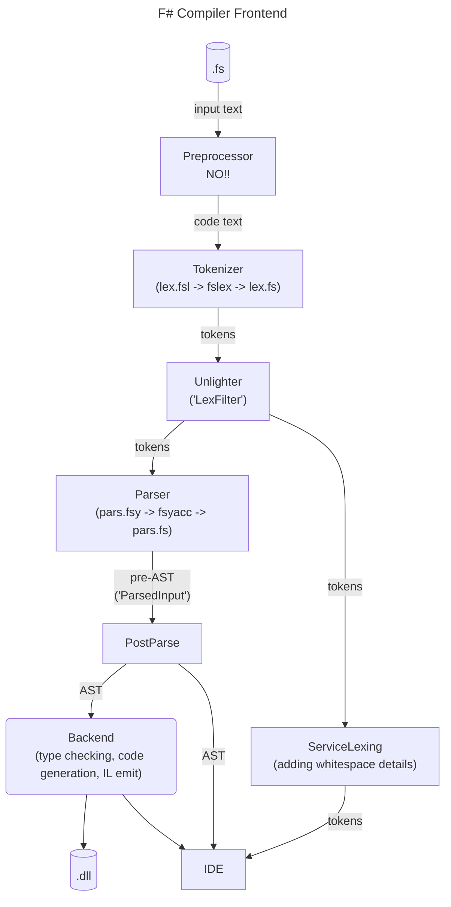

```mermaid
---
title: F# Compiler Frontend
---
graph TB
  A[(.fs)]
    -- input text --> 
  Pre["`Preprocessor
    NO!!`"]
    -- code text -->
  T["`Tokenizer
    (lex.fsl -> fslex -> lex.fs)`"]
    -- tokens -->
  U["`Unlighter
    ('LexFilter')`"]
    -- tokens -->
  P["`Parser
    (pars.fsy -> fsyacc -> pars.fs)`"]
    -- "`pre-AST
    ('ParsedInput')`" -->
  PostParse -- AST -->
  B("`Backend
    (type checking, code generation, IL emit)`")
    --> E[(.dll)]
  U -- tokens -->
  S["`ServiceLexing
    (adding whitespace details)`"]
    -- tokens -->
  IDE
  B --> IDE
  PostParse -- AST --> IDE
```

